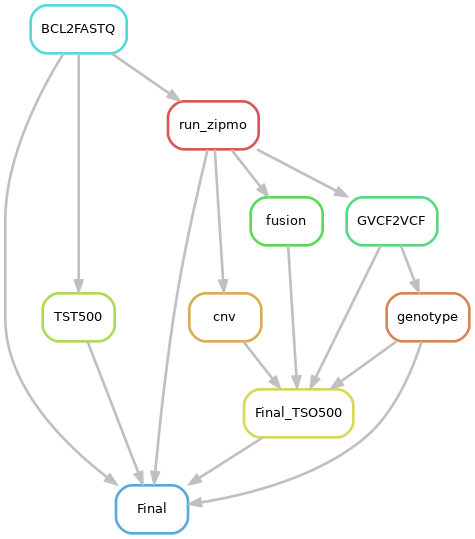
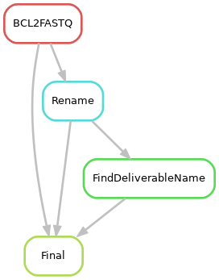
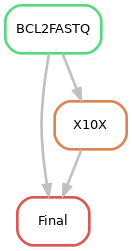

# bcl2fastq pipeline on moab
## Demultiplexing
- Runs illumina bcl2fastq with different settings depending on SampleSheet:
	- Run with TSO500 specific arguments when SampleSheet is from TSO500 experiments
	- Run with 10X cellranger mkfastq wrapper when SampleSheet is 10X Single Cell 
	- Run with default parameters in all other cases
		When Different types of Asssay are sequenced on the same Flowcell, ideal to have only one assay samples in SampleSheet and let this pipeline ran for 1 assay, then rename the output folder and Change the SampleSheet for other assay samples and manually launch this pipeline.
## Rename default fastq file names
- For the samples ran with defaule parameters, the fastq files are renamed to carray FCID.
## Find Deliverable Name
- This rule creates globus transfer command input for individual samples and based on the lookup table "Master.txt" the globus transfer files can carry the same name as provided in SampleSheet or the one found in lookup table. for example the control samples name does not get changed but a PDMR deliverable sample name get changed from PDA ID to deliverable sample ID
## 10X Pipeline
- When SampleSheet is for 10X samples cellranger count is ran on all the samples.
## TSO500 Pipeline
- When SampleSheet is for TSO500, following is done:
	- zipmo pipeline from Illumina
	- Convert GVCF 2 VCF
	- Create a .gt (genotype) file for genotyping purposes
	- Create a simple fusion report
	- Create a simple CNV report from the VCF file
	- Create a final QC report and send email to #run_stats channel on Slack.
	- Still to add: Annotation and variant filtering from the VCF file (MOMA)	
This is a plug and play part of the pipeline and can be removed/suppressed easily by commenting `include: SOURCE +"/tso500.rules"` line in bcl2fastq.snakemake
## Email report on run to interested parties
- This is the final rule, globus transfer individual files are concatenated to one and a globus transfer is requested. It also parses the html output from bcl2fastq to create a report at FC level, lane level and sample level. This report is emaild to user and #run_stats channel on Slack.
	- If SampleSheet is for shallowseq samples, the fastq files get transferred to biowulf and this job waits for the transfer to finish. Once the transfer is finished successfully the ShallowSeq pipeline is launched on biowulf:
		`ssh -q biowulf.nih.gov "cd /data/MoCha/ShallowSeq/; sh launchShallowSeq.sh {FCID}"`
	- If SampleSheet is 10X, do nothing but report generation and email.
	- If SampleSheet is TSO500, do nothing but report generation and email.
	- If SampleSheet is Other Assays (WES/RNASEQ), transfer data to biowulf and generare report/email.
# Running This pipeline:
- Manual Run:
	`perl /projects/lihc_hiseq/active/bcl2fastq.v2/automate.pl`
- Auto Run:
	Run /projects/lihc_hiseq/active/bcl2fastq.v2/automate.pl as cronjob at a frequency you are comfortable with. 

### Rulegraph for TSO500 SampleSheet

### Rulegraph for WES SampleSheet

### Rulegraph for 10X SampleSheet

